# Baasha Jobs: Free Civilian Job Pack for FiveM

**By [Baasha Bhai Studio](https://www.baashabhai.com)** · Support: [discord.gg/5XjyX44FQs](https://discord.gg/5XjyX44FQs)

Free and open source civilian jobs with **crews, XP levels, a job center tablet and weekly leaderboards**.
Works on **ESX, QBCore and Qbox**, with **ox_target or qb-target**, and **ox_inventory, qb-inventory or ESX inventory**. All of these are detected automatically.

| Resource | What it is |
|---|---|
| `baasha_jobcore` | Required. Crews, XP and levels, pay, work vehicles, uniforms, job tablet (`/jobs`), leaderboards, framework bridge |
| `baasha_garbage` | Garbage Collector: crew truck routes, bag carrying, compactor, recyclables |
| `baasha_fishing` | Fishing: Deep Drop minigame, 25 species with item photos, Fish Market, boat rental, deep-sea fishing |
| `baasha_mining` | Mining: Rock Breaker minigame, ores and gems with item photos, dynamite boulders, smelter, Mining Office |

More jobs coming. They all plug into the same core.

🎬 **Showcase video:** _coming soon_

| | |
|---|---|
| 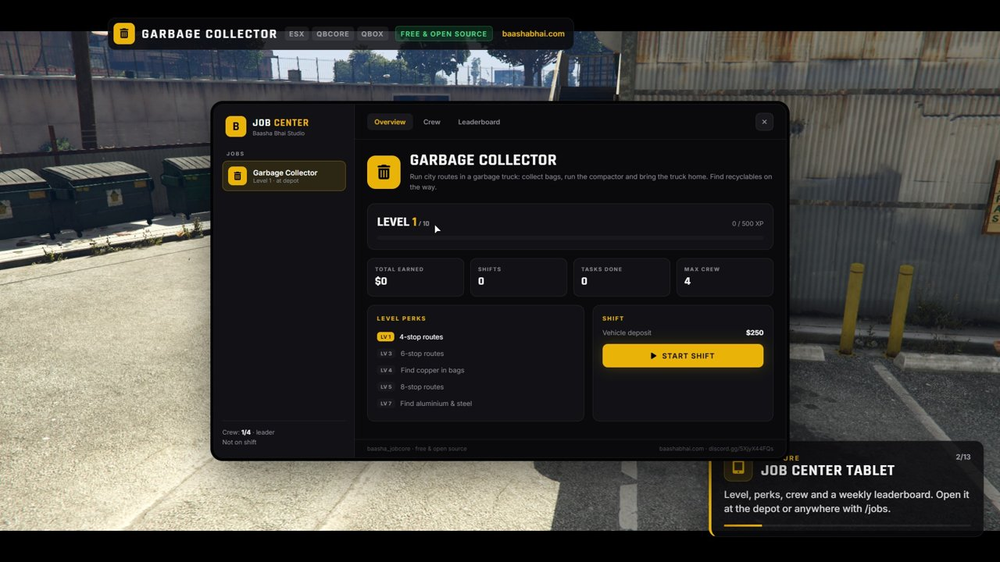 | 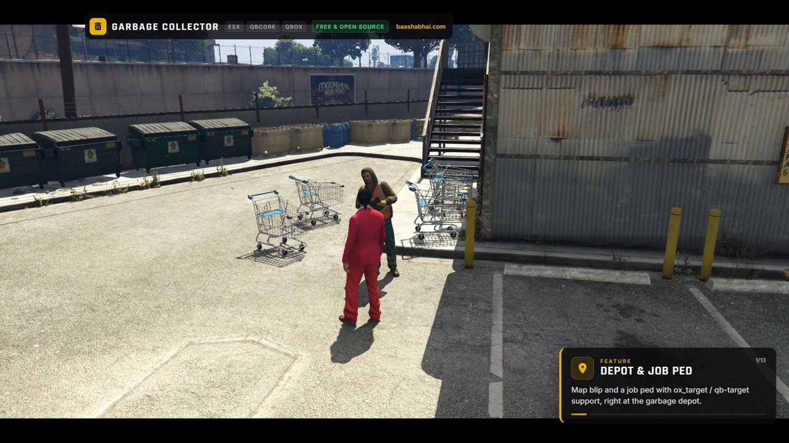 |
| 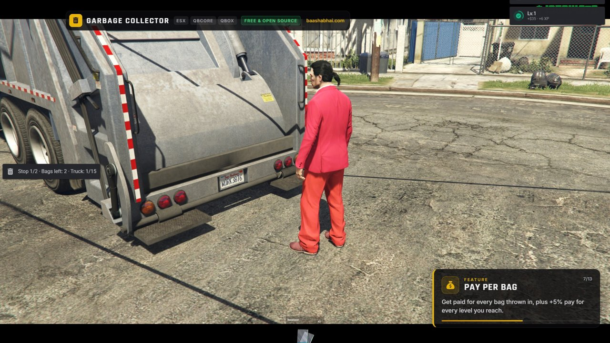 | 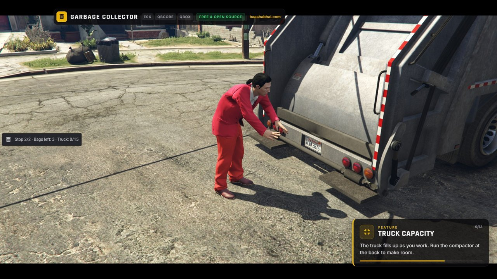 |
| 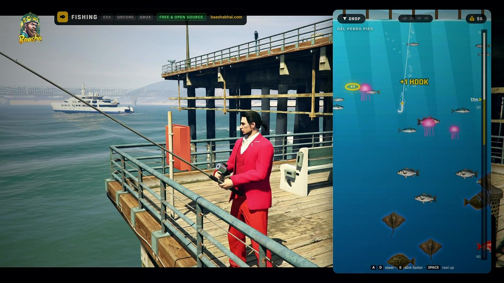 | 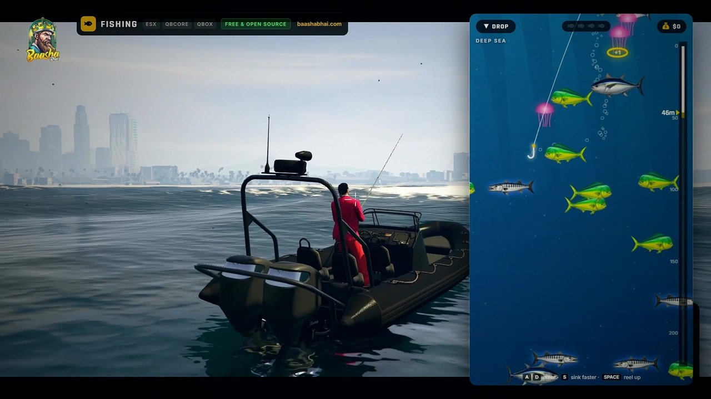 |
| 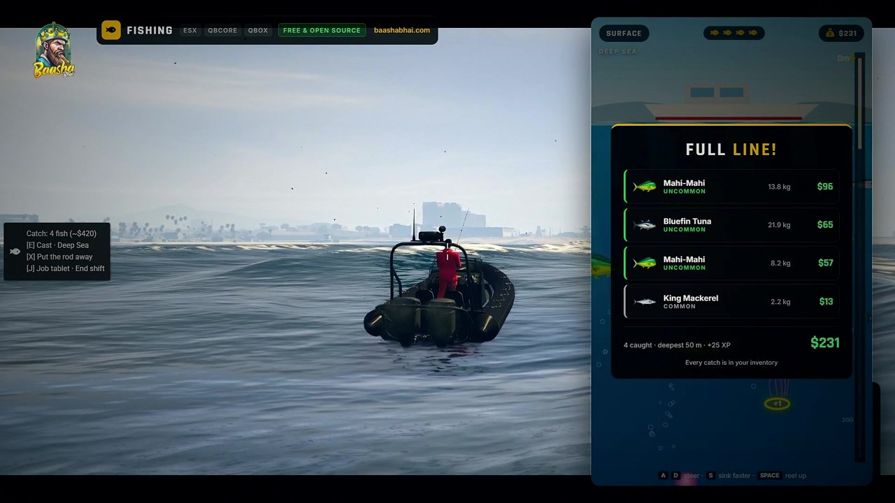 | 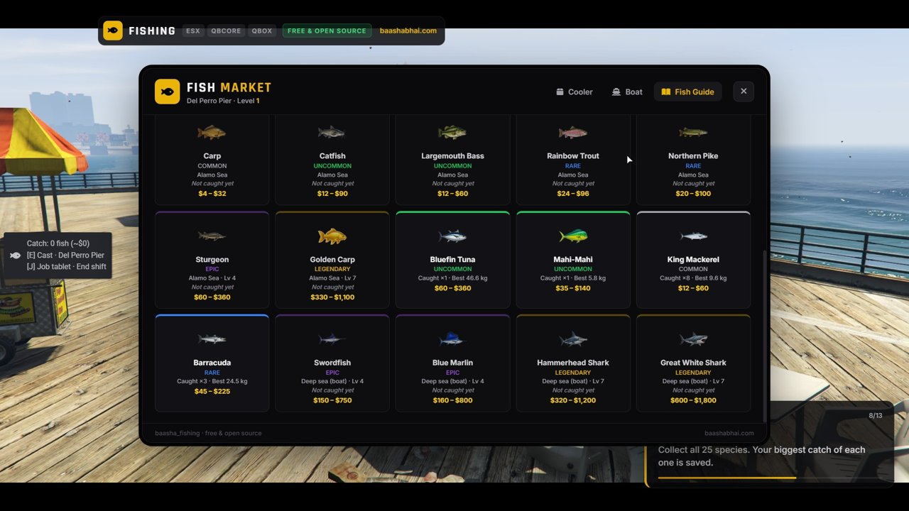 |
| 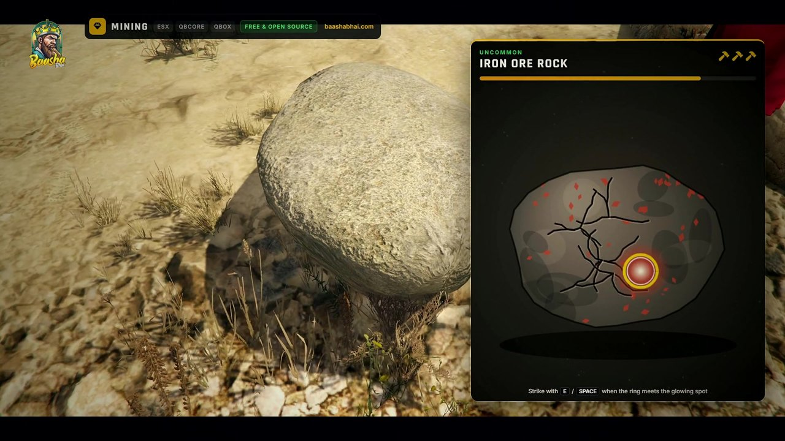 | 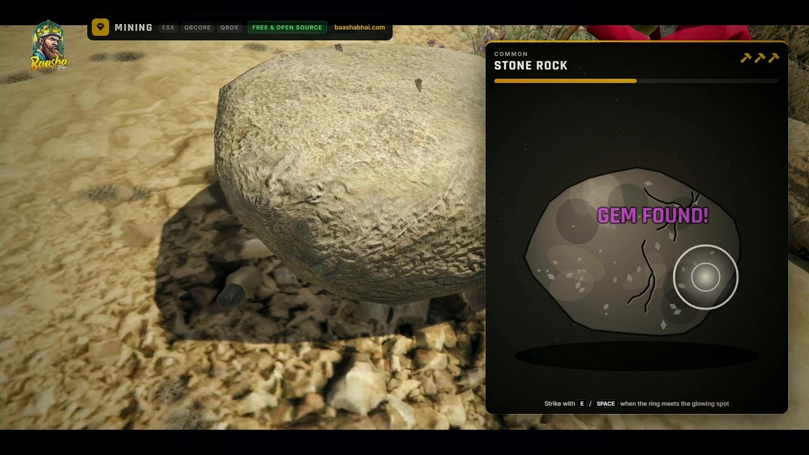 |
| 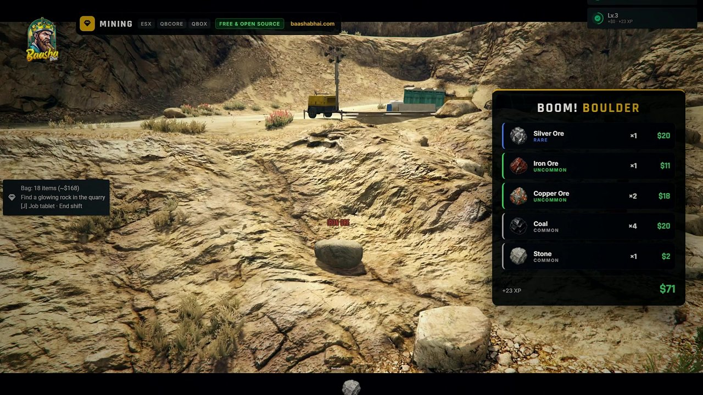 | 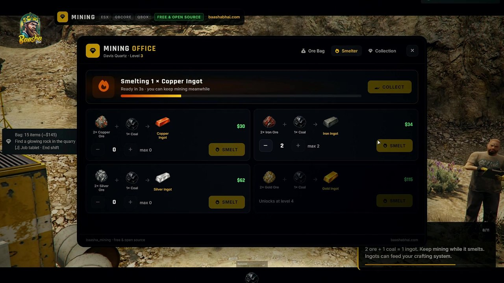 |

---

## Features

**Job core**
- 📱 **Job center tablet** (`/jobs`, the depot ped, or **J** while on a shift): level, XP bar, perks, stats, crew, leaderboard. The key only works on a shift, so it never clashes with other scripts.
- 👥 **Crews of up to 4.** Invite nearby players. Pay is shared with a crew bonus of up to +20%.
- ⭐ **10 levels per job.** Pay goes up with level (+5% per level), and perks unlock as you level.
- 🚛 **Work vehicles** are spawned server-side so the whole crew sees the same one. Deposits are refunded based on damage, and keys and fuel are handled for you.
- 👕 **Optional uniforms**, restored when the shift ends
- 🏆 **Weekly leaderboards** for each job
- 🛡️ **Server-side validation** on every action, plus a reward rate limit
- 🔔 **Discord webhook** shift logs
- 🧩 **Open bridge and editable files** for notify, fuel, keys and pay hooks
- 🏷️ **Job vehicles are flagged** with the state bag `baashaJobVehicle`, so car theft, impound and garage scripts can leave them alone

**Garbage Collector**
- Random city routes. Higher levels get longer routes and better finds.
- Bags you can see at each stop, synced across the crew. Bend down to pick one up, carry it, and throw it into the back of the truck.
- Bags are always placed on walkable ground. You can also hand-place them for any stop with `Config.BagSpots`.
- Limited truck capacity, so someone has to **run the compactor**
- **Recyclables** (plastic, glass, rubber, scrap, copper, aluminium, steel) that feed into crafting
- Finish the route at the depot for a route bonus and a new route, without ending the shift

**Fishing**
- 🎣 **Deep Drop minigame:** drop the hook and dodge fish on the way down, then steer into as many as you can on the way up. Jellyfish knock your last fish off, and gold rings give an extra hook.
- 🌊 **Every spot has its own water:** piers with a sea floor, junk and octopus, Alamo Sea with lake fish and sunken branches, and the deep sea 200 m down with tuna, marlin and sharks
- 🐟 **25 species + junk**, from anchovies to the Great White Shark, each with its own size, value and **item photo** (28 icons included)
- 🎒 **Real inventory items** (ox_inventory, qb-inventory, ESX). If an item isn't installed, the catch goes into a built-in cooler instead.
- 🏪 **Fish Market** at the pier kiosk (floating $ sign): your catch with photos and prices, Sell all, boat rental and the **Fish Guide** collection (photos, where to find each fish, price ranges, your biggest catch)
- 🚤 **Boat rental** with a refundable deposit. Sail 350 m+ from shore for deep-sea fishing.
- ⭐ **Levels:** a longer line, more hooks, new spots (Alamo Sea Lv 2, Paleto Lv 3), epic fish from Lv 4 and legendary fish from Lv 7
- 🛡️ **Server-built dives:** the server decides which fish are where, their weight and value, and checks every result (depth, hooks, timing), so catches can't be faked
- 🔁 Prefer a simpler game? Set `Config.Minigame = 'strike'` for a one-fish-per-bite spinning-ring game

**Mining**
- ⛏️ **Rock Breaker minigame:** a weak spot glows on the rock and a ring closes in. Strike when they meet: PERFECT hits give bonus ore, cracks spread until the rock shatters, and your pickaxe swings in sync. Easy at level 1, tougher at high levels.
- 💎 **Gem veins:** sometimes a vein sparkles. Hit it for amethyst, emerald, sapphire, ruby or diamond (with carat sizes).
- 🪨 **Glowing ore rocks** at the Davis Quartz quarry, shared by everyone. They crumble after 3 uses and grow back. Locked rocks show the level they need.
- 🧨 **Dynamite boulders (level 3):** plant a charge, step back, BOOM: a pile of ore. A visual blast only, so it's safe with anti-cheats.
- 🔥 **Smelter:** 2 ore + 1 coal = 1 ingot, worth more than raw ore. Keep mining while it smelts. Point the ingots at your crafting items (`iron`, `copper`…) in the config.
- 🏢 **Mining Office:** your ore bag with photos and prices (Sell all), the smelter and a **Collection** of every ore and gem you've found
- 🎒 **15 items with photos** (ores, ingots, gems). If an item isn't installed, finds go into a built-in ore bag instead.
- ⭐ **Levels:** silver and the Gold Vein Ridge (Lv 2), dynamite (Lv 3), gold (Lv 4), the jackhammer (Lv 5) and diamonds (Lv 7)
- 🛡️ **Server-owned rocks:** the server decides every find and checks the minigame timing, so nothing can be faked
- 📍 Add your own rock spots in-game with `/miningspot` (admins)

## Requirements
- [ox_lib](https://github.com/overextended/ox_lib)
- [oxmysql](https://github.com/overextended/oxmysql)
- qbx_core, qb-core **or** es_extended
- ox_target **or** qb-target

## Installation
1. Drop the `[baasha_jobs]` folder into your `resources` folder.
2. Add this to `server.cfg` **after** your framework, ox_lib, oxmysql and target:
   ```cfg
   ensure baasha_jobcore
   ensure baasha_garbage
   ensure baasha_fishing
   ensure baasha_mining
   ```
3. Running `qb-garbagejob`? Stop it, because it uses the same depot:
   ```cfg
   stop qb-garbagejob
   ```
4. **Fishing and mining items (recommended):** add the items and their pictures to your inventory. Everything is in `baasha_fishing/install/` and `baasha_mining/install/`:
   - **qb-inventory:** paste `qbcore_items.lua` into `qb-core/shared/items.lua`, copy `images/*.png` to `qb-inventory/html/images/`
   - **ox_inventory:** paste `ox_inventory_items.lua` into `ox_inventory/data/items.lua`, copy `images/*.png` to `ox_inventory/web/images/`
   - **ESX:** run `esx_items.sql`, copy `images/*.png` to your inventory's image folder

   Skipping this is fine: catches then go into the built-in cooler (fishing) or ore bag (mining) and are sold at the market / office.
5. Restart the server. The database table is created automatically.

## Configuration
| File | What to change |
|---|---|
| `baasha_jobcore/config.lua` | Framework, pay account, crew bonus, level XP, tablet command and key, webhook |
| `baasha_jobcore/editable/*.lua` | Notifications, vehicle keys, fuel, hooks for pay and level-ups |
| `baasha_garbage/config.lua` | Depot, truck, deposit, uniform, carried bag position, pay per bag, route length by level, recyclables, stops, hand-placed bag spots |
| `baasha_fishing/config.lua` | Market and boat position, minigame (`deepdrop` or `strike`), line length and hooks by level, which fish live at which depth, species, prices, rarities, spots, items or cooler |
| `baasha_mining/config.lua` | Foreman and office position, rock spots per area, ores and gems (prices, levels), minigame speed, dynamite, smelter recipes and ingot items, tools, items or ore bag |

## For developers: adding a job
Register your job from a server script and the core handles the rest: the depot ped, blip, tablet, crew and truck.

```lua
exports.baasha_jobcore:RegisterJob('myjob', {
    label = 'My Job', icon = 'fa-solid fa-briefcase', description = '...', maxCrew = 2,
    depot = { coords = vector4(...), ped = 's_m_m_dockwork_01', blip = { sprite = 280, color = 5 } },
    vehicle = { model = 'boxville2', deposit = 200, spawns = { vector4(...) } },
    perks = { { level = 1, text = '...' } },
})

AddEventHandler('baasha_jobcore:server:shiftStarted', function(jobId, crewId, crew) end)
AddEventHandler('baasha_jobcore:server:shiftEnded', function(jobId, crewId, reason) end)

exports.baasha_jobcore:RewardCrew(crewId, amount, xp)   -- split between crew members
exports.baasha_jobcore:RewardPlayer(src, amount, xp)    -- one member's own task
exports.baasha_jobcore:GiveItem(src, item, count)
exports.baasha_jobcore:GetCrew(crewId) / GetPlayerCrew(src) / IsOnShift(src, jobId) / GetLevel(src, jobId) / EndShift(crewId)
```

Client exports: `GetShift()`, `IsOnShift(jobId)`, `GetWorkVehicle()`, `OpenTablet(jobId)`.

Other scripts can skip job vehicles with:
```lua
if Entity(vehicle).state.baashaJobVehicle then return end
```

## License
Free to use and modify on your own server. **Do not resell, reupload or remove credits.** See [LICENSE](LICENSE).

---
Want more? Premium jobs and MLOs are at **[baashabhai.com](https://www.baashabhai.com)**.
